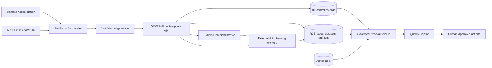
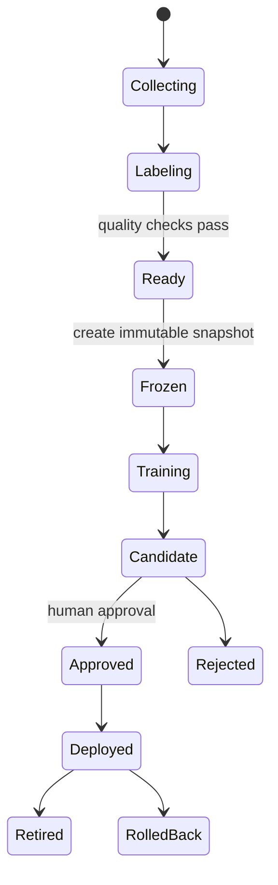

# QEVRA AI production architecture

## Product boundary

QEVRA AI is a multi-user industrial visual-quality platform. The web control
plane manages products, datasets, training, model governance, deployments,
inspections, reviews, traceability, and knowledge retrieval. Safety-critical
pass/fail decisions remain with validated inspection recipes and deterministic
quality rules. Generative AI may explain and retrieve evidence, but may not
silently override an inspection or promote a model.

## System topology

## Trust boundaries

1. **Identity boundary:** Sites dispatch authenticates users. Application APIs
   derive identity only from trusted dispatch headers.
2. **Tenant boundary:** every durable record and object key is scoped by
   organization. Authorization is checked before querying or mutating data.
3. **Recipe boundary:** a camera or upload must be routed to an approved product
   and variant recipe before inference. Unknown products are held for enrollment.
4. **Training boundary:** web requests create asynchronous jobs. GPU work runs
   outside the request lifecycle against an immutable dataset snapshot.
5. **Promotion boundary:** completed training creates a candidate model. An
   authorized quality/ML approver must approve it before deployment.
6. **RAG boundary:** retrieval is tenant- and role-filtered. Answers cite source
   revisions. Tool actions require explicit authorization and human confirmation.

## Storage model

- **D1:** organizations, users, roles, plants, stations, products, recipes,
  datasets, snapshots, jobs, models, deployments, inspections, reviews, and
  audit events.
- **R2:** original images, thumbnails, heatmaps, manifests, annotations,
  documents, model artifacts, and exports.
- **Vector index:** embeddings plus minimal filter metadata; original content
  remains in D1/R2.
- **Edge buffer:** bounded encrypted queue for offline inspection records and
  image evidence, replayed idempotently after reconnect.

## Dataset lifecycle

Uploads are resumable and checksum-addressed. Metadata records the product,
variant, lot, shift, supplier, station, camera profile, lighting state, label,
split, annotation revision, and uploader. Train/dev/test leakage checks occur
before a snapshot can enter training.

## Model and inference contract

- Supported task families: anomaly detection, classification, detection,
  segmentation, OCR/OCV, and governed hybrid rule/AI pipelines.
- Every model records its dataset snapshot, code/trainer version, configuration,
  metrics, artifact checksum, approver, and deployment history.
- Every inspection records recipe/model versions, source, station, product,
  serial/batch context, score, heatmap/object references, latency, model decision,
  operator disposition, and audit history.
- Operator acceptance changes the final disposition; it never rewrites the
  original model prediction. Retraining candidacy is a separate action.

## Training provider contract

The control plane submits an immutable snapshot reference and typed training
configuration to an external provider. The provider must support idempotent job
creation, signed artifact upload, status polling/webhooks, cancellation, logs,
metrics, failure reasons, and artifact checksums. Missing provider configuration
produces `provider_required`; it must never produce a fake completed model.

## RAG and agent architecture

RAG sources include approved SOPs, specifications, defect books, control plans,
CAPA/8D, maintenance records, inspection history, operator comments, dataset
reports, and model reports. Ingestion preserves document revision, effective
dates, tenant, product/recipe scope, and access labels.

Retrieval uses authorization filters, keyword search, vector similarity,
metadata filters, and reranking. Responses return source citations. Image
embeddings provide similar-defect search but do not replace validated inference.
Agent workflows may draft investigations, CAPA/8D, dataset-readiness plans, or
retraining proposals. Dataset mutation, training, model approval, deployment,
and production-control actions always require explicit human authorization.

## Delivery sequence

1. Durable identity, tenant model, D1 schema, R2 object layout, and audit events.
2. Product/variant/recipe registry and persistent inspection/review history.
3. Bulk dataset ingestion, explorer, label book, quality gates, and snapshots.
4. Training-provider integration, evaluation, comparison, approval, and rollout.
5. Edge station lifecycle, offline behavior, industrial integrations, and drift.
6. Governed document/image ingestion, retrieval, Quality Copilot, and agents.
7. Load, security, recovery, model-governance, and RAG evaluation before GA.

## Non-negotiable release gates

- No cross-tenant query or object access.
- No unknown-product inference through a mismatched recipe.
- No mutable training snapshot.
- No model promotion without recorded approval and evaluation evidence.
- No generative answer without traceable sources for production guidance.
- No agent mutation without role validation, confirmation, and an audit event.
- No claim of production readiness based only on public benchmark data.
